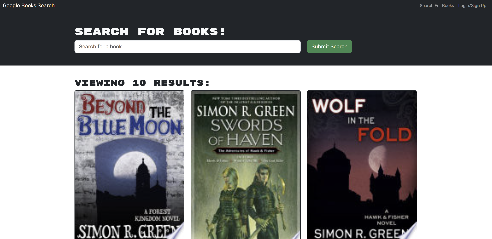

# Book Search using graphql

## Description
This application is a very simple book tracker using graphQL and allows for authentication among other things. The motivation behind this was to give me a chance to learn graphQL a bit better. The application allows for searching for books, saving books (e.g. a potential reading list or a list of things you have read) as well as removing books from that list.

## Installation

1. Clone the repository.
2. Run ```npm i``` to install the dependencies.
3. Run ```npm run develop`` to run both the client and server.


## Usage

The production version can be seen [here](https://graph-ql-book-search-engine.onrender.com). Simply Sign up and start searching for books!

## Credits

N/A

## License
[MIT](https://choosealicense.com/licenses/mit/)
